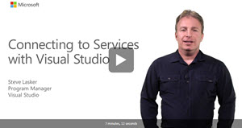
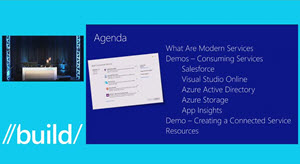

# Connected Services ![][ConnectedServiceLogo]

###Videos of Connected Service usage###

[An overview of Connected Services on Channel 9](http://channel9.msdn.com/Shows/Visual-Studio-Toolbox/Connected-Services)

[A 7 minute demo of Connected Services showing Visual Studio Online, Salesforce, security the site with Azure Active Directory and analytics with App Insights](https://channel9.msdn.com/Series/Visual-Studio-2015-Enterprise-Videos/Connecting-to-Services-with-Visual-Studio)

[//build 2015: On the Shoulders of Giants: Building Apps that Consume Modern SaaS Endpoints with Visual Studio 2015](https://channel9.msdn.com/Events/Build/2015/3-759)

### Microsoft Connected Services###
* [Azure Active Directory](http://go.microsoft.com/fwlink/?LinkId=513809)
* [Office 365]( http://go.microsoft.com/fwlink/?LinkID=512158)
* [Azure Storage](http://go.microsoft.com/fwlink/?LinkId=513126)
* [Azure Mobile Services](http://azure.microsoft.com/en-us/services/app-service/mobile/)
* [Application Insights](http://go.microsoft.com/fwlink/?LinkID=511987)

### Partner Connected Service###
* [Salesforce](https://visualstudiogallery.msdn.microsoft.com/site/search?f%5B0%5D.Type=SearchText&f%5B0%5D.Value=salesforce&f%5B1%5D.Type=User&f%5B1%5D.Value=Salesforce%20Developer%20Program&f%5B1%5D.Text=Salesforce%20Developer%20Program)
* [Datalogics](http://www.datalogics.com/ConnectedService)

### Building Connected Services###
For information on how to build a Connected Service: [Connected Services SDK](https://github.com/Microsoft/ConnectedServices/tree/master/SDK)

### Providing Feedback
We value your feedback as we build out the Connected Services ecosystem and SDK. You can provide feedback via:
 
* [User Voice](https://visualstudio.uservoice.com/forums/265038-connected-services) for suggestions and issues on the core Connected Services experience in Visual Studio
* [Connected Services SDK Issues](https://github.com/Microsoft/ConnectedServices-ProviderAuthorSamples/issues) for SDK Feedback
[ConnectedServiceLogo]: ./media/CloudConnectedServices_32x.png

