#Creating a Connected Service Extension

The Visual Studio Connected Services feature lets app developers connect their applications to service providers that run in the cloud, or on premises. The Connected Services feature can automate the multiple steps it takes to connect a Visual Studio project to a service.

The great thing about the new Connected Services experience is that it is fully extensible. Anyone can build a Visual Studio extension that adds a new Connected Service to the Add Connected Services dialog. A Connected Service can enable any Visual Studio application to connect to any service. In this article, I'm going to explain to you how to get started building your own Connected Service extension.

With a custom Connected Service, you have the full power of the Visual Studio extensibility APIs to perform modifications to a developer's project. This lets you automate any steps a developer normally has to do manually to connect their application to the service.

For an overview of Connected Services, see the [Connected Services overview](https://github.com/Microsoft/ConnectedServices-ProviderAuthorSamples/tree/master/docs).

## Definitions

To get started, let's define some terms:

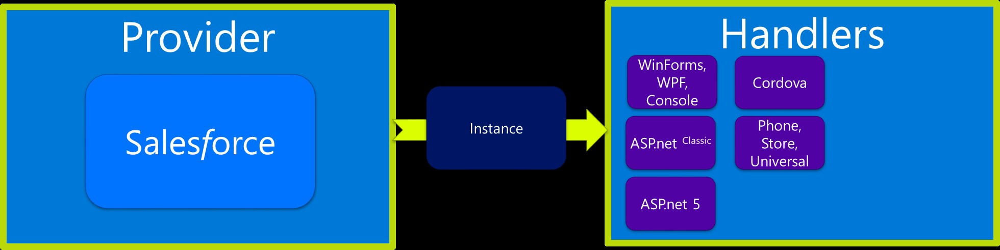

- **Connected Service Author** If you're reading this document, that's you. The author of a Connected Service extension.
- **Provider** A Connected Service provider controls the UI where the app developer declares their intent and options for configuring the project to consume the service. 
- **Configurators** Connected Service Authors have a choice for how their provider will capture information from the app developer. Connected Services supports Grid, SinglePage and Wizard configurator implementations. 
- **Handler** A Connected Service handler is responsible for taking the configuration information that the app developer specifies in the configurator and modifying the service to be consumed (such as OAuth configuration) and modifying the project to consume the selected service. These modifications include adding values to app or app/web.config files, adding References, NuGets, scaffolding code, etc. Multiple handlers can be associated with a single provider to support different project types. For example, one handler can be written for ASP.NET projects, while another is written to support JavaScript Cordova projects.
- **Instance** A Connected Service Instance is the hand-off of configuration data from the provider to the handler.

# Writing an Extension

Visual Studio uses the [Microsoft Extensibility Framework](http://msdn.microsoft.com/en-us/library/dd460648) (MEF) to load extensions. Code inside Visual Studio creates an extension point by defining a contract (which is like a .Net interface), and declaring that it "imports" the contract. Anyone who wants to plug into that extension point just has to "export" a component that adheres to the contract. At runtime, Visual Studio finds and invokes all the components that adhere to the contract.

The Connected Services feature in Visual Studio does just that. It defines an extension point and a contract: the abstract [ConnectedServiceProvider](https://msdn.microsoft.com/en-us/library/microsoft.visualstudio.connectedservices.connectedserviceprovider(v=vs.140).aspx) class. To create your own extension to Connected Services, you implement a class that inherits from the [ConnectedServiceProvider](https://msdn.microsoft.com/en-us/library/microsoft.visualstudio.connectedservices.connectedserviceprovider(v=vs.140).aspx) class and Export it.

To do this, you first need VS 2015 and the VS 2015 SDK installed.

## Creating the Connected Service Project

The VS 2015 SDK installs an 'Extensibility' of project and item templates:

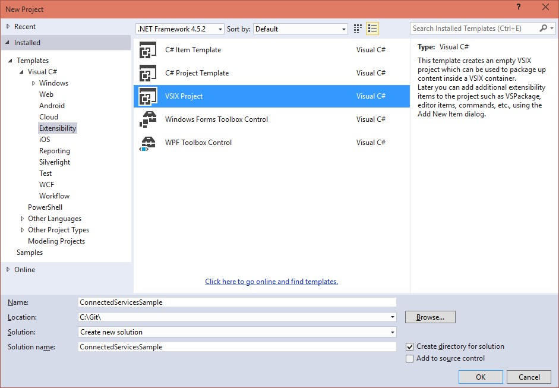

Choose the "VISX Project" template, which will create a new project that can extend Visual Studio, and name it " **ConnectedServiceSample**".

## Adding MEF Support

Since Connected Services uses MEF to let Visual Studio know about the extension, we need to add a MEF Asset to the project

- Open the source.extension.vxixmanifest file in the project, and select the Assets tab
- Click the New button, and select the following values, including the name of your project.

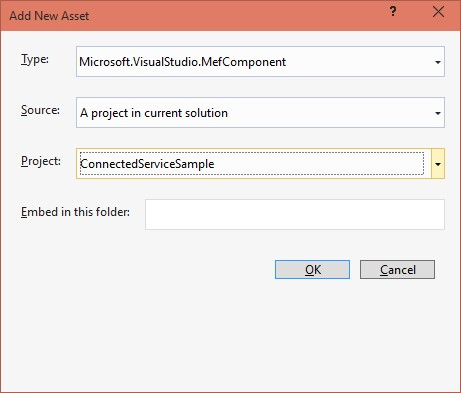

Now you have a Visual Studio extension that can export MEF components to add functionality in VS.

## Setting Dependencies

Since Connected Services is itself built as a Visual Studio extension, you'll also want to add a dependency on the Connected Services extension. Adding the dependency will warn developers attempting to uninstall the Connected Services extension that you're Connected Service will no longer work.

- In source.extension.vsixmanifest, switch to the Dependencies tab and add a New Dependency. Set these field values in the dialog: 
- Source: "Installed extension"
- Name: "Microsoft Connected Services"
- Version Range: [2.0,)
This value specifies  version 2.0 or higher.
For more info on how version ranges work see [VSIX Extension Schema 2.0 Reference](https://msdn.microsoft.com/en-us/library/hh696828.aspx)

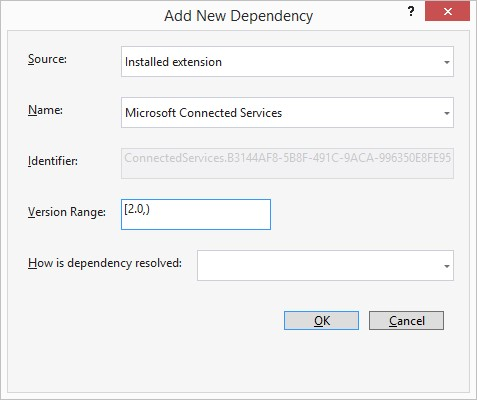

## Including the Connected Service in the VSIX

By default, a VSIX project doesn't include the project output into the VSIX, which means you're VSIX won't actually install your Connected Service

- Select the project Properties and set Include Assembly in VSIX Container to **true.** 

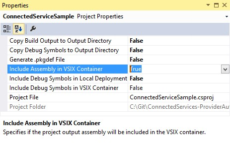

## Add the Connected Services SDK from NuGet

With the VSIX package configured, you're ready to start adding Connected Services to your project references. The Connected Services SDK NuGet package contains the MEF contracts to build a Connected Service Extension and the XML Intellisense documents.

With the project selected in Solution Explorer, choose Manage NuGet packages from the context menu.

In the Package Manager window, search for **"Connected Service"**.

- **Pre RTM Note:** *Be sure to check the Include prerelease checkbox*

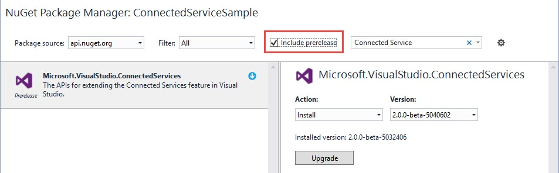

# Creating a Provider

Now that we're coding, the first step will be to get your Connected Service provider to appear in the Add Connected Service dialog

In the root of the project, create a new class named Provider

Add the following code

	using Microsoft.VisualStudio.ConnectedServices;
	using System;
	using System.Threading.Tasks;
	namespace ConnectedServiceSample
	{
		[ConnectedServiceProviderExport("Contoso.SampleService")]
		internal class Provider : ConnectedServiceProvider
		{
			public Provider()
	        {
	            this.Category = "Sample";
	            this.Name = "Sample Connected Service";
	            this.Description = "A sample Connected Services";
	            this.Icon = null;
	            this.CreatedBy = "Contoso";
	            this.Version = new Version(1, 0, 0);
	            this.MoreInfoUri = new Uri("https://aka.ms/ConnectedServicesSDK");
	        }
	        public override Task<ConnectedServiceConfigurator> CreateConfiguratorAsync(ConnectedServiceProviderContext context)
	        {
	            return null;
	        }
	    }
	}

The class inherits from the [ConnectedServiceProvider](https://msdn.microsoft.com/en-us/library/microsoft.visualstudio.connectedservices.connectedserviceprovider(v=vs.140).aspx) base class and has a ConnectedServiceProviderExport attribute with one required value, the ProviderId. This string uniquely identifies the provider and is used to reference the handler. While the ProviderId must be unique, the format is by convention [Company].[Service]. Or in our case, "**Contoso.SampleService**". When we create a handler, you'll see how the ProviderId connects the handlers to the providers.

The provider class specifies the property values that are used in the Add Connected Services dialog. You can choose to set the Icon property to an image resource, or 'null' if you don't have an image for testing. We recommend that you do have an image when you actually release your extension. You can see examples for setting the icon in the [Connected Services Samples](https://github.com/Microsoft/ConnectedServicesSdkSamples).

We'll discuss the [CreateConfiguratorAsync](https://msdn.microsoft.com/en-us/library/microsoft.visualstudio.connectedservices.connectedserviceprovider.createconfiguratorasync(v=vs.140).aspx) method later when we need to fill it out. For now, we'll just return 'null'.

This is the minimum information that Visual Studio needs to show your extension in the Add Connected Services dialog.

## Debugging Your Provider

When you start debugging (F5) your project, Visual Studio will launch an [Experimental Instance of Visual Studio](https://msdn.microsoft.com/en-us/library/bb166560.aspx). The Experimental Instance is a sandboxed instance of Visual Studio where you can try out your extensions while they are in development without affecting your real Visual Studio installation. If you are having problems with getting F5 to work, make sure the Debug settings in your startup project properties are set to the following:

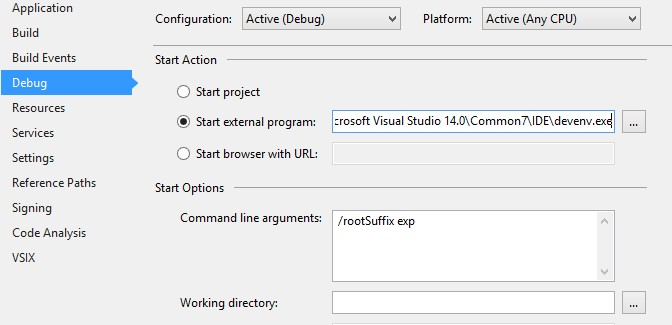

In the Experimental Instance of Visual Studio, create a new Console Application project, and right-click the project in the solution "Add -> Connected Service…" and you will see your new provider in the dialog:

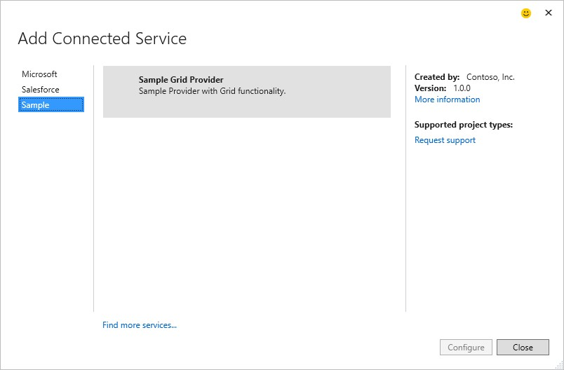

Notice that the "Configure" button is disabled in the Connected Service dialog. A Connected Service provider needs to find a class that handles the configuration for the project. Because there is no available handler with the same ProviderId that supports the current project type, Visual Studio disables the Configure button.

To enable the button, we will need to create a handler for this provider and project type.

# Creating a Handler

Stop debugging, and add a new class named **Handler** to the root of your project with the following code:

	using Microsoft.VisualStudio.ConnectedServices;
	using System;
	using System.Threading;
	using System.Threading.Tasks;
	namespace ConnectedServiceSample
	{
		[ConnectedServiceHandlerExport("Contoso.SampleService",
		AppliesTo = "CSharp+Web")]
		internal class Handler : ConnectedServiceHandler
		{
			public override Task<AddServiceInstanceResult> AddServiceInstanceAsync(ConnectedServiceHandlerContext context, CancellationToken ct)
			{
				AddServiceInstanceResult result = new AddServiceInstanceResult(
					"Sample",
					new Uri("https://github.com/Microsoft/ConnectedServicesSdkSamples"));
				return Task.FromResult(result);
			}
		}
	}

Visual Studio finds handlers in the same way that it finds providers, using MEF. This class is decorated with a ConnectedServiceHandlerExport attribute, allowing VS to find it when it searches for available handlers. The attribute's first parameter matches the ProviderId of the provider. This is how providers and handlers are matched up. A handler specifies which provider it corresponds to using a matching ProviderId value.

The value of the attribute's AppliesTo parameter specifies what types of Visual Studio projects this handler supports. The full syntax for specifying these strings is available in the [AppliesTo](http://msdn.microsoft.com/en-us/library/dn497698.aspx) documentation on MSDN. The one used in the example declares that any C# Web project is supported. If you have a console application, or any VB project, the Configure button will remain disabled. But for C# Web projects, the Configure button will be enabled.

You will implement the changes to the app developer's project in the AddServiceInstanceAsync method. We'll show you to do in a later section. For now, we simply return a simple instance of the AddServiceInstanceResult.

F5 again, create a C# Web project, open the Connected Service dialog, and you will see the sample provider can now be configured.

Now that the Configure button is enabled, you are probably going to want to click it. However, if you do, you get the exception message:

_The Connected Services component ' Sample Provider' failed: (HRESULT:0x80131509) The Connected Service Provider 'Contoso.SampleService' returned an invalid ConnectedServiceConfigurator from the CreateConfiguratorAsync method. A valid object should inherit from ConnectedServiceGrid, ConnectedServiceSinglePage, or ConnectedServiceWizard._

# Creating a Configurator

The provider creates a configurator to collect required and optional data that is needed add the service to the app developer's project. The data is returned as a ConnectedServiceInstance object which the provider supplies to the handler.

Implementing the [CreateConfiguratorAsync](https://msdn.microsoft.com/en-us/library/microsoft.visualstudio.connectedservices.connectedserviceprovider.createconfiguratorasync(v=vs.140).aspx) method leads to one of the first big choices you make about how you want to collect the app developer's configuration choices. Depending on the size and complexity of the choices, you can choose between the "Grid", "SinglePage" or  "Wizard" configurator templates.

## [Grid](https://msdn.microsoft.com/en-us/library/microsoft.visualstudio.connectedservices.connectedservicegrid(v=vs.140).aspx)

The Grid configurator is a list of services from which the app developer chooses. While the Grid configurator is the easiest to implement, it is also the most restrictive in the kind and complexity of the user's possible choices.

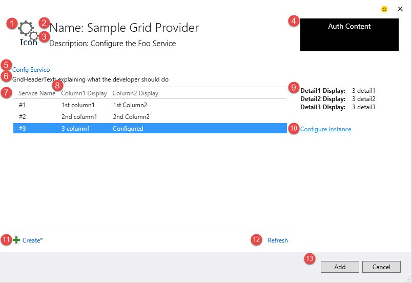

## [Single Page](https://msdn.microsoft.com/en-us/library/microsoft.visualstudio.connectedservices.connectedservicesinglepage(v=vs.140).aspx)

The SinglePage configurator lets you implement a WPF user control that takes up most of the configurator dialog. In the user control, you can use any set of WPF controls to collect the user's data.

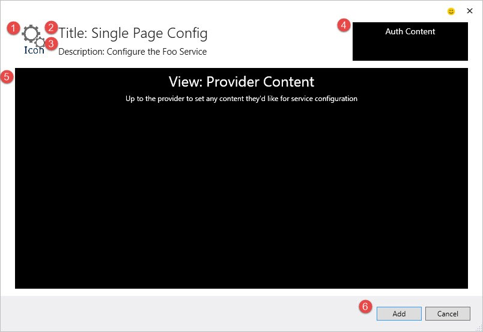

## [Wizard](https://msdn.microsoft.com/en-us/library/microsoft.visualstudio.connectedservices.connectedservicewizard(v=vs.140).aspx)

The Wizard control lets the user navigate among a number of configurator pages. Like the SinglePage configurator, you implement a user control for each page to collect the data.

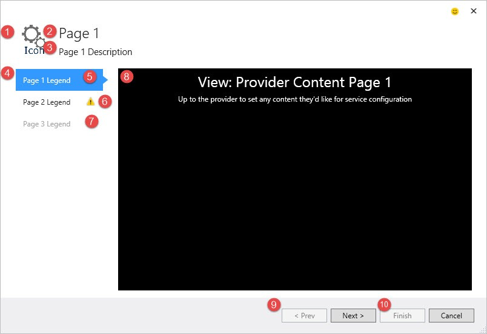

We'll show you how to implement a SinglePage configurator and return it as a [ConnectedServiceSinglePage](https://msdn.microsoft.com/en-us/library/microsoft.visualstudio.connectedservices.connectedservicesinglepage.aspx) object to the provider.

## WPF, MVVM and Connected Service Templates

Configurator UIs are created using a variation of the WPF Model-ViewModel-View (MVVM) design pattern that separates the data and logic of the UI (the ViewModel class) from the XAML that displays it (the View class). The behavior of View elements are controlled by the ViewModel through WPF data binding.

The Connected Services runtime supplies the View for the Grid configuator, you only have to describe the list items in a class derived from the abstract ConnectedServiceGrid ViewModel.

The Connected Services runtime provides the outer dialog frame for all configurators. When you add a WPF user control and derive its ViewModel from one of the three configurators (ConnectedServiceGrid, ConnectedServiceSinglePage, ConnectedServiceWizardPage), the parent View incorporates the control and user-defined values.

# Implementing a SinglePage Configurator

To get started with a SinglePage configuration, aligning with the MVVM pattern, we need two classes; the View and the ViewModel, and we'll place them in grouped folders:

- Create two folders for the **Views** and **ViewModels**. 
- Add an empty class named **SinglePageViewModel.cs** to a **ViewModels** folder
- Add a WPF UserControl named **SinglePageView.xaml** to the **Views** folder.
Select the Views folder. From the context menu, choose.Add New Item, then choose User Control (WPF). 

Your project should now look like the following:

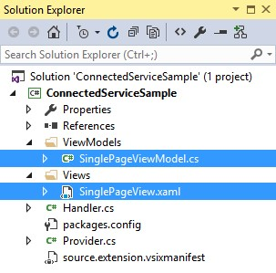

## Implementing the SinglePageViewModel Class

The SinglePageViewModel class collects and stores the user data. In our simple case, we'll simply capture the name the developer wishes to name their service instance.

To start with, we need to inherit from the [ConnectedServiceSinglePage](https://msdn.microsoft.com/en-us/library/microsoft.visualstudio.connectedservices.connectedservicesinglepage(v=vs.140).aspx) class. This class provide the basic Connected Service functionality to your provider.

Replace the ViewModel class with the following code:

	using Microsoft.VisualStudio.ConnectedServices;
	using System.Threading.Tasks;
	namespace ConnectedServiceSample.ViewModels
	{
		public class SinglePageViewModel : ConnectedServiceSinglePage
		{
			public SinglePageViewModel()
			{
				this.View = new Views.SinglePageView();
				this.View.DataContext = this;
				this.Title = "Contoso Sample Provider";
				this.Description = "Configure the Contoso Service";
			}
			public override Task<ConnectedServiceInstance> GetFinishedServiceInstanceAsync()
			{
			    ConnectedServiceInstance instance = new ConnectedServiceInstance();
			    return Task.FromResult(instance);
			}
		}
	}

In this example, we only want the app developer to provide us a name for the service instance. To store the name, we'll create a property named ServiceName. To make sure our WPF View gets updated, we'll follow the MVVM databinding pattern and raise an [INotifyPropertyChanged](https://msdn.microsoft.com/en-us/library/system.componentmodel.inotifypropertychanged.aspx) event. Rather than have to implement this pattern yourself, the ConnectedServiceSinglePage class provides an OnPropertyChanged method. Better yet, you don't even need to pass the name of the property in quotes. The value is calculated for you.

Add the following property definition to the SinglePageViewModel

	private string _serviceName;
	public string ServiceName
	{
		get { return _serviceName; }
		set
		{
			if (value != _serviceName)
			{
				_serviceName = value;
				OnPropertyChanged();
			}
		}
	}

## Enabling the Add button

By default, the Add button is disabled. The assumption is your developer must do something before they can complete the configuration. In our case, we just need a valid ServiceName.

In the constructor, define an event handler for the PropertyChanged event:

	public SinglePageViewModel()
	{
		this.View = new Views.SinglePageView();
		this.View.DataContext = this;
		this.Title = "Contoso Sample Provider";
		this.Description = "Configure the Contoso Service";
		this.PropertyChanged += SinglePageViewModel_PropertyChanged;
	}

Then, do some validation. In our case, it's pretty simple:

	private void SinglePageViewModel_PropertyChanged(object sender, System.ComponentModel.PropertyChangedEventArgs e)
	{
		this.IsFinishEnabled = !string.IsNullOrWhiteSpace(ServiceName);
	}

We'll use the ServiceName value as the name of the Connected Service folder, and the name referenced in the app project's config file. To set this up, in the GetFinishedServiceInstanceAsync method, set the instance.Name to the ServiceName property we've asked our developer to provide. Your code should look like the following:

	public override Task<ConnectedServiceInstance> GetFinishedServiceInstanceAsync()
	{
		ConnectedServiceInstance instance = new ConnectedServiceInstance();
		instance.Name = this.ServiceName;
		return Task.FromResult(instance);
	}

Now, when your developer tabs out of the ServiceName textbox, the validation will kick in, and enable the Add button

## Adding the SinglePage View

Now that we have our ViewModel with the information we need to capture, let's create a View over it.

- To get a sense of how much space you have to work with, we can set the design time height and width.
- To get the designtime databinding we'll add the designtime DataContext. We first add an alias to our ViewModels namespace, then we set the designtime datacontext.

Your UserControl declaration should now look like the following:

	<UserControl x:Class="ConnectedServiceSample.Views.SinglePageView"
	xmlns="http://schemas.microsoft.com/winfx/2006/xaml/presentation"
	xmlns:x="http://schemas.microsoft.com/winfx/2006/xaml"
	xmlns:mc="http://schemas.openxmlformats.org/markup-compatibility/2006"
	xmlns:d="http://schemas.microsoft.com/expression/blend/2008"
	xmlns:local="clr-namespace:ConnectedServiceSample.Views"
	xmlns:viewModels="clr-namespace:ConnectedServiceSample.ViewModels"
	d:DataContext="{d:DesignInstance Type=viewModels:SinglePageViewModel}"
	mc:Ignorable="d"
	d:DesignHeight="367" d:DesignWidth="754">

To capture the service name, we'll replace the empty WPF Grid layout control with a StackPanel that contains a label and textbox that is bound to the ServiceName property of the SinglePageViewModel class.

	<StackPanel>
		<Label>Service Name:</Label>
		<TextBox Text="{Binding Path=ServiceName}"></TextBox>
	</StackPanel>

## Connectinging the Configurator to the Provider

With our View and ViewModel now ready, we'll want to tell the provider where to find them. To hook our SinglePageView to our provider, we'll go back to the CreateConfiguratorAsync method.

Open the **Provider** class and update the CreateConfiguratorAsync with the following code:

	public override Task<ConnectedServiceConfigurator> CreateConfiguratorAsync(ConnectedServiceProviderContext context)
	{
		ConnectedServiceConfigurator configurator = new ViewModels.SinglePageViewModel();
		return Task.FromResult(configurator);
	}

In this code snippet the **CreateConfiguratorAsync** method was overridden to return a new instance of the SinglePageViewModel we've created, which defines the view used.

## Try it out

If you F5 your extension now, load a Web project, open the Connected Services dialog, and click the Configure button for the Sample provider you will see your SinglePage template populated.

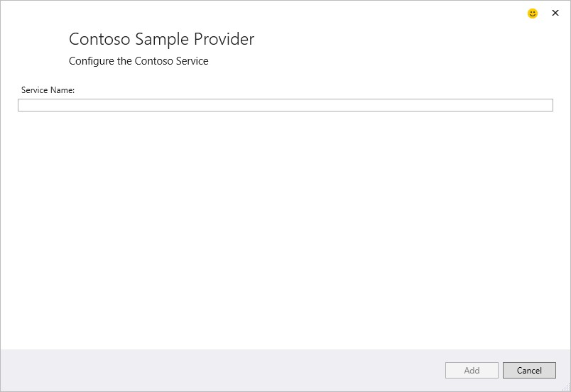

###Other UI Options

This is the minimum needed to create a UI and collect data using a SinglePage configurator. But there are other customization options you can choose such as overriding the CreateAuthenticatorAsync method to add a WPF control in the top right of the dialog that can sign users into your service.

For example, you could use a hyperlink to pop open a sign in dialog, or integrate with Visual Studio's Account Picker control to get an account from the KeyChain.

See the [SinglePageAuth sample](https://github.com/Microsoft/ConnectedServicesSdkSamples/tree/master/src/Auth/SinglePage) for more info.

# Making Project Changes

We're now ready to create the UI for our sample service provider. The Provider class specifies the information to show in the Add Connected Services selection dialog. Selecting a Connected Service initializes the SinglePageViewModel to create the UI to collect user information with the SinglePageView. Once the developer chooses **[Add]**, the SinglePageViewModel configurator creates the ConnectedServiceInstance to pass to the Handler. We now need to implement the Handler class to make the changes to the app project that adds our service.

Handler classes derived from the [ConnectedServiceHandler](https://msdn.microsoft.com/en-us/library/microsoft.visualstudio.connectedservices.connectedservicehandler.aspx) class to implement specific project changes. Handlers are associated with specific project types based on the AppliesTo attribute. In many cases you'll have more than one handler. For instance, you may want to provide service configurations for ASP.NET C# and VB projects. This of course uses C# and VB.NET code and .NET References. However, if you want to support JavaScript projects, like Cordova, you'll need to add JavaScript to the project, including various script files. Or, you may want to target ASP.NET 5 or UAP Windows projects, which uses different coding patterns, references and a config.json file.

In our basic sample project, we'll just add a value to the app's web.conig file, and create a folder in the app's project hierarchy for artifacts we might need as we expand the service functionality.

## Implementing the Handler Class

Open the Handler class and notice the method AddServiceInstanceAsync. The method returns a Task, so if you need to write asynchronous code, you can implement the async/await pattern. The result of the Task is an object of type AddServiceInstanceResult, which takes two values:  a " **folder name"** and a " **getting started**" URL. When the handler is finished executing, a folder will be created under the "Service References" folder that will contain the Connected Service artifacts. The "getting started" URL is a link to documentation that you want to show your developers to get them started using the connected service.

The input into AddServiceInstanceAsync is a ConnectedServiceHandlerContext object that's provided by the Connected Services runtime. The context parameter contains all the input information to the handler. Some important members of this class are:

- ** The ProjectHierarchy property represents the VS Project that should be modified. At this point, anything that is possible to do with Visual Studio extension APIs can be invoked to manipulate the project using [IVsHierarchy](https://msdn.microsoft.com/en-us/library/microsoft.visualstudio.shell.interop.ivshierarchy.aspx)
- ** The [ServiceInstance](https://msdn.microsoft.com/en-us/library/microsoft.visualstudio.connectedservices.connectedserviceinstance.aspx) property contains the information that was configured by the provider and returned in the [GetFinishedServiceInstanceAsync](https://msdn.microsoft.com/en-us/library/microsoft.visualstudio.connectedservices.connectedservicesinglepage.getfinishedserviceinstanceasync.aspx) method on the SinglePageViewModel. It contains the name of the service, and any other information the provider wants to give to the handler. Connection information related to the service your configuring is a common piece of data to pass along in the ServiceInstance.
- ** The [Logger](https://msdn.microsoft.com/en-us/library/microsoft.visualstudio.connectedservices.connectedservicelogger(v=vs.140).aspx) property is used for writing debugging information and other messages you wish the developer to see. This information is displayed in progress dialog, and it is logged to the Visual Studio Output window as well. By setting the [Category](https://msdn.microsoft.com/en-us/library/microsoft.visualstudio.connectedservices.loggermessagecategory.aspx), you can specify how the message is communicated to the developer. 

## Making Project Changes

Most providers will make several changes to the project. Some changes may take some time, such as adding NuGets, references, or calling services to retrieve metadata to scaffold code. While making project changes, using the async/await pattern and the Logger, you can actively report progress to the developer letting them know what's happening. Output sent thru the Logger is also sent to the Output window.
As an example of what you can do to the project, let's add the name of our service to the web.config file and we'll show how the Logger and Progress dialog work. 

If you choose to support class libraries, Console, WinForm or WPF apps, the same code will manage app.config files as well.

In the **Handler** class, replace the **AddServiceInstnaceAsync** method with the following:

	publicasyncoverrideTask<AddServiceInstanceResult> AddServiceInstanceAsync(ConnectedServiceHandlerContext context, CancellationToken ct)
	{
		await context.Logger.WriteMessageAsync(LoggerMessageCategory.Information, "Updating Config");
		using (EditableXmlConfigHelper configHelper = context.CreateEditableXmlConfigHelper())
		{
			configHelper.SetAppSetting(
				string.Format("{0}:ConnectionString", context.ServiceInstance.Name),
				"SomeServiceConnectionString",
				context.ServiceInstance.Name
			);
			configHelper.Save();
		}
		Thread.Sleep(1000);
		await context.Logger.WriteMessageAsync(LoggerMessageCategory.Information, "Adding NuGets");
		Thread.Sleep(1000);
		await context.Logger.WriteMessageAsync(LoggerMessageCategory.Information, "Adding References");
		Thread.Sleep(1000);
		AddServiceInstanceResult result = newAddServiceInstanceResult(
			context.ServiceInstance.Name,
			newUri("https://github.com/Microsoft/ConnectedServicesSdkSamples"));
		return result;
	}

Reviewing the code above:

- We've made the method async to support awaiting the various steps. Using async and await, the Connected Services UI will remain responsive to the developer. 
- We use the [Logger](https://msdn.microsoft.com/en-us/library/microsoft.visualstudio.connectedservices.connectedservicelogger.aspx) to inform the developer of the progress
- We use an EditableXmlConfigHelper class to interact with web/app.config files. Note the use of the Save and IDisposable pattern to assure we're closing out the file resource.
- In the EditableXmlConfigHelper we specify the Name/Value pair of the config entries, and we can also add a comment. In large projects, this can be really helpful to isolate your specific service settings. Notice we use the ServiceName to individually identify the config names. Many services, such as SQL or Azure Storage may be consumed multiple times in a single project, so you'll want to allow your developer to individually name these configuration values.
- We call Thread.Sleep to simulate activities and logger messages to show the execution steps in the progress dialog.
- Finally, we return a AddServiceInstanceResult object with the name of our service, and the uri of our Getting Started document.

## Running the Completed Connected Service Project

Press F5 to run the project.

In the Visual Studio Experimental Instance, open or create a C# Web Project. Choose Add Connected Service and then choose the sample connected service. Enter a ServiceName such as **MyService** , press Tab and click the Add button.

So, what happens?

- The progress dialog is displayed while the handler is executing. 

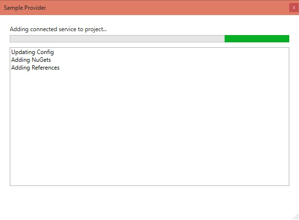

- Values are added to web.config file.

		<!--MyService-->
		<addkey="MyService:ConnectionString"value="SomeServiceConnectionString" />
	</appSettings>

- A Connected Service folder is created in the Service References of the project, named MyService based on the folder name passed thru the AddServiceInstanceResult

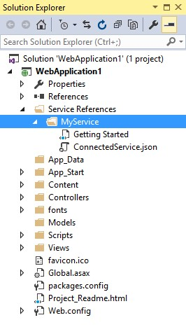

# A Getting Started virtual node is created to help your developers get back to your docs after they close the page.What Next?

At this point, the code you need to write depends on your service's requirements. Some common things that handlers implement are:

- Authenticate against, and configure your service for OAuth consumption. This typically incudes provisioning a ConsumerSecret and Token.
- Installing a NuGet package for runtimes your service depends upon, such as a client SDK.
See the " [Invoking NuGet Services from inside Visual Studio](http://docs.nuget.org/docs/reference/invoking-nuget-services-from-inside-visual-studio)" article for more information on automating NuGet tasks.
  - To increase the stability and performance of your provider, we recommend embedding the NuGet package(s) your Connected Service requires in your Visual Studio extension instead of downloading the package from a remote repository. See the [IVsPackageInstaller.InstallPackagesFromVSExtensionRepository](http://docs.nuget.org/docs/reference/Extensibility-APIs) method for more information.

- Modifying the application's configuration (app.config, web.config, config.json, etc.)
- Adding references

- Scaffolding code into the project typically done with user modifiable T4 templates. See the [Salesforce Connected Service Reference Implementation](https://github.com/developerforce/visual-studio-tools) for an example of T4 template usage. 

- Adding non-code files.

The last four tasks can be accomplished with helper methods in the ConnectedServiceHandlerContext object.

We'll continue to make additional samples available over time in the [Connected Services Samples Repo](https://github.com/Microsoft/ConnectedServicesSdkSamples)sitory. For a complete reference implementation, please see the open source [Connected Service Salesforce provider](https://github.com/developerforce/visual-studio-tools).

## Publish your VSIX to the Visual Studio Gallery

As you may have noticed in the Add Connected Services dialog, there's a link to find more… This launches the Extensions & Updates dialog, which is a view into the [Visual Studio Gallery](https://visualstudiogallery.msdn.microsoft.com/site/search?f%5B0%5D.Type=RootCategory&f%5B0%5D.Value=tools&f%5B0%5D.Text=Tools&f%5B1%5D.Type=SubCategory&f%5B1%5D.Value=tools_connectedservices&f%5B1%5D.Text=Connected%20Services&f%5B2%5D.Type=VisualStudioVersion&f%5B2%5D.Value=14.0&f%5B2%5D.Text=Visual%20Studio%2014), with the Connected Services tools category selected.

So, go ahead and upload your provider, and help developers easily consume your services.

# Summary

Now you have the complete Visual Studio extensibility APIs at your disposal to build up your Connected Service extension. To leave us feedback or get feedback on your provider implementation, please contact us through the [Connected Services UserVoice forum](https://visualstudio.uservoice.com/forums/265038-connected-services)

# References

- [Connected Services Home page](https://github.com/Microsoft/ConnectedServices)
- [Connected Services SDK Home page](https://github.com/Microsoft/ConnectedServices/SDK)
- [Connected Services SDK Reference Documents](https://msdn.microsoft.com/en-us/library/dn930812(v=vs.140).aspx)
- [Connected Services Samples Git Repo](https://github.com/Microsoft/ConnectedServicesSdkSamples)sitory
- [Connected Service Sample from this walk through](https://github.com/Microsoft/ConnectedServicesSdkSamples/tree/master/src/Walkthroughs/ConnectedServiceSample)
- [Connected Services UserVoice forum](https://visualstudio.uservoice.com/forums/265038-connected-services)
- [Salesforce Connected Service Reference Implementation](https://github.com/developerforce/visual-studio-tools)
- [VSIX Deployment](https://msdn.microsoft.com/en-us/library/ff363239.aspx)
- [VSIX Extension Schema 2.0 Reference](https://msdn.microsoft.com/en-us/library/hh696828.aspx)
- [Visual Studio Gallery](https://visualstudiogallery.msdn.microsoft.com/site/search?f%5B0%5D.Type=RootCategory&f%5B0%5D.Value=tools&f%5B0%5D.Text=Tools&f%5B1%5D.Type=SubCategory&f%5B1%5D.Value=tools_connectedservices&f%5B1%5D.Text=Connected%20Services&f%5B2%5D.Type=VisualStudioVersion&f%5B2%5D.Value=14.0&f%5B2%5D.Text=Visual%20Studio%2014)
- [Experimental Instance of Visual Studio](https://msdn.microsoft.com/en-us/library/bb166560.aspx)
- [MVVM Overview by John Papa](http://www.johnpapa.net/5-minute-overview-of-mvvm-in-silverlight/)
- [MVVM by Josh Smith](https://msdn.microsoft.com/en-us/magazine/dd419663.aspx)
