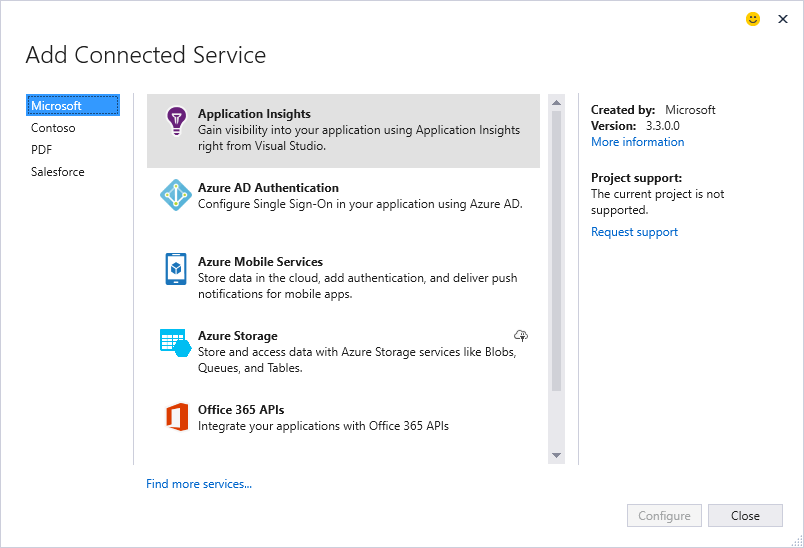
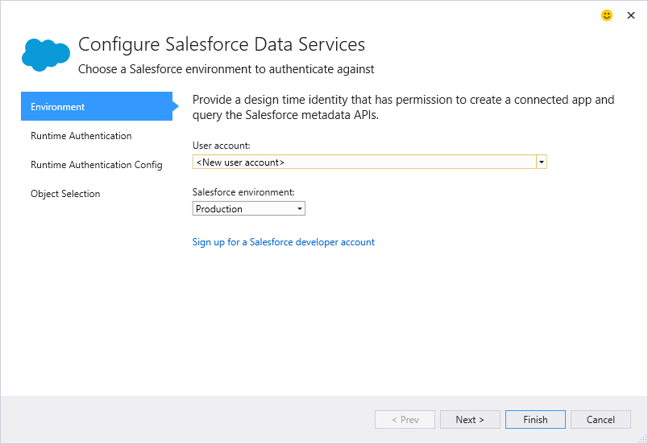

#The Do's and Don'ts for authoring Connected Services#

The following are common do's and don'ts to consider when building a Connected Service. 

The first of which is:

- Do read the **[Principles doc]()** Yes, it's long, but it has all the guiding principles for how to build a successful Connected Service
- Don't **just read this**, assuming the brief bullets explain the "why" for the do's and don'ts
- Do **use this as a reminder** of the things to look for, and what your developers will be looking for as they use your Connected Service

## Discovery/Selection Experience ##
Here's some things to consider, relating to the general user experience, including how to surface your information in Service Selection and Configuration.

- Do list your Connected Service in the **left category listing** by its technology instead of using your company name. While it's nice to advertise your company, will developers be looking for your company, or will they be looking for specific service types. For instance, developers may not know of Datalogics, but they do want PDF services.
- Don't use the **category as an advertisement** for your company, use the **[Created By](https://msdn.microsoft.com/en-us/library/microsoft.visualstudio.connectedservices.connectedserviceprovider.createdby.aspx)** property
- Don't create **multiple entry points** in various menus just so developers can find your service.
- Do **provide update** scenarios, helping your developers get continual value. See the [sample for Update](https://github.com/Microsoft/ConnectedServicesSdkSamples/tree/master/src/UpdateSupport)

## Configuration Experience ##

- Do **capture all the information** in the configurators, and **wait to configure the service and project** after the developer presses the [Add/Update/Finish] button
- Don't **make any service or project changes** before the user presses the [Add/Update/Finish]
- Do **keep the user in the Connected Services configuration** experience, doing all the required server side configuration for them
- Don't create **new windows** to show progress or messages
- Don't create a **list of TODO's**, like goto this link, do these steps, copy this value, ...
- Do take advantage of the [Connected Service and signature dialog WPF styles](./ModifyingWPFStyles.md) to handle the various **Visual Studio themes**
- Do **provide MRUs** for all values the developer may have to enter
- Don't make the developer **look up things** you can do for them, such as the list of URLs for production and staging endpoints of your service.
- Do **cache their design time user-name and OAuth tokens** to avoid having to login each time
## Long Running Operations ##
- Do use the **[Progress Indicator](https://msdn.microsoft.com/en-us/library/microsoft.visualstudio.connectedservices.connectedserviceprovidercontext.startbusyindicator.aspx)** for long running operations. See the [Samples for Progress Indicators](https://github.com/Microsoft/ConnectedServicesSdkSamples/tree/master/src/ProgressIndicators)
- Do provide **progress during handler** configuration using the [Logger](https://msdn.microsoft.com/en-us/library/microsoft.visualstudio.connectedservices.connectedservicelogger.aspx) classes

# Making Service and Project Changes #
Developers may select your Connected Service, they may even go part way through the configuration, but they may realize they don't have everything ready, or were just curious. To maintain a trust that they can safely explore without doing damage, you should never make service or project changes until they press the Add/Update/Finish. Committing changes should be done in the handler.
The one exception many of the Azure services have done is create some of the endpoints. For instance, you can't connect to a Storage Account unless it exists. This was actually a leftover from the Visual Studio 2013 implementation, and is limited by the design of the GridConfigurator. If we were to re-design these experiences, we'd follow the experience we built for Salesforce, and capture the name of the storage account, and defer to creating it in the handler, after the user pressed Add/Update/Finish. 

# Project Configuration #
- Do provide **templates for any code** scaffolded into their projects. Use T4, razor, or other appropriate templates
- Do **preserve their template customization's** when the developer uninstalls or upgrade your connected service
- Do consider your developers may want/need **multiple instances** of your service, and allow them to name the instance added
- Do **scaffold only the unique code** to their service/project

## Generating vs. Scaffolding ##
The details of retiring the "Can't Touch This" style of code generation and tooling. For more info, see this [7 min video](https://channel9.msdn.com/Series/Visual-Studio-2015-Enterprise-Videos/Connecting-to-Services-with-Visual-Studio).

- Do **use SDKs and Client Libraries** for the common code across all service instances 
- Don't assume Connected Services is just a **customizable Add Service Reference** to generate lots of code
- Do **scaffold the code** your developers will need 90%, not 80% of the time
- Don't **generate code** into their project that gets replaced when they update the service 
- Do **use [roslyn]()** to understand their project artifacts
- Do scaffold code in the **same way the developer would write the code** themselves. For instance, add `using ` statements
- Don't generate types with fully qualified namespaces
- Do scaffold code using **best practices** for the specific API/scenario

## Performance ##
- Do **cache NuGets** in your VSIX for performance and stability of your configuration 
- Do all service calls and lengthy operations using the **async** pattern 

## Configuration ##
- Don't persist **design time information** that can get out of sync with their code 
- Do save **hints* in the ConnectedService.json file for where artifacts may be
- Don't create additional designer files 
- Don't **fail if the hints are invalid**, or the developer moved the artifacts from where they were the first time
- Do **put code comments and config headings** at the top of your config entries with the [SetAppSetting](https://msdn.microsoft.com/en-us/library/microsoft.visualstudio.connectedservices.editablexmlconfighelper.setappsetting.aspx) API

# Getting Started Documentation #
- Do **provide getting started online pages** that explain what you did for them, to your service, and to *their* project with the [GettingStartedDocument](https://msdn.microsoft.com/en-us/library/microsoft.visualstudio.connectedservices.addserviceinstanceresult.gettingstarteddocument.aspx) property
- Do provide the **hello world samples** in the getting started pages
- Don't add **sample code** to their project, even if you think about giving them a checkbox. 

# General Development #
- Do consider making your Connected Service **open source** as others may want to improve your connected service, and if it improves your service usage, why not
- Do consider the [.NET Foundation](http://www.dotnetfoundation.org/) to help mitigate legal concerns of going open source
- Do consider **versioning** your VSIX, Provider, Assembly consistently
- Do take the time to learn **MVVM** as it will make your development much easier to manage state between configuration steps
- Do use **client libraries/SDKs** that match each project type
- Do the **right thing for the specific project**
- Don't attempt to make **all project types work the same** (JavaScript, Python, .NET). See [Supporting Connected Services across multiple project types](./SupportingConnectedServicesAcrossMultipleProjects.md)
- Do **reference, copy, clone, infer, borrow code** from the [Connected Service Samples]() and the [Salesforce Connected Service](), open source reference implementation
- Do use [GitHub issues]() to engage with us, log issues, make suggestions
- Do **engage with us** to help you build a great Connected Service experience 
