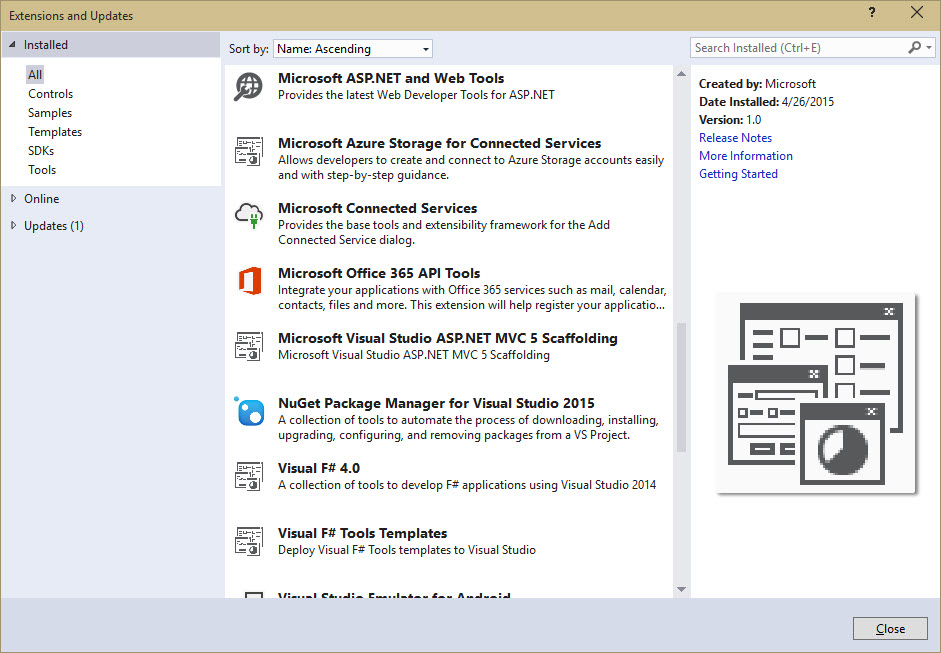
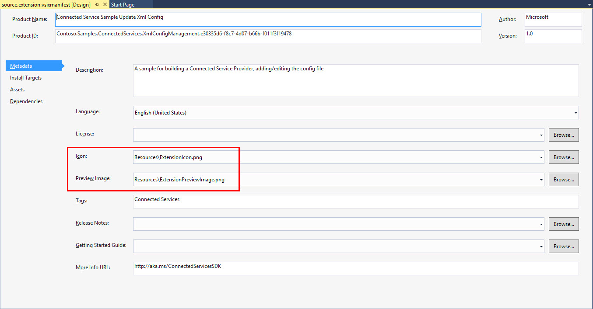
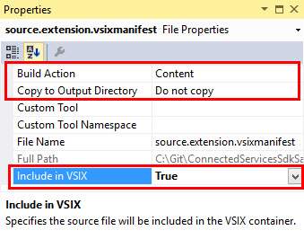
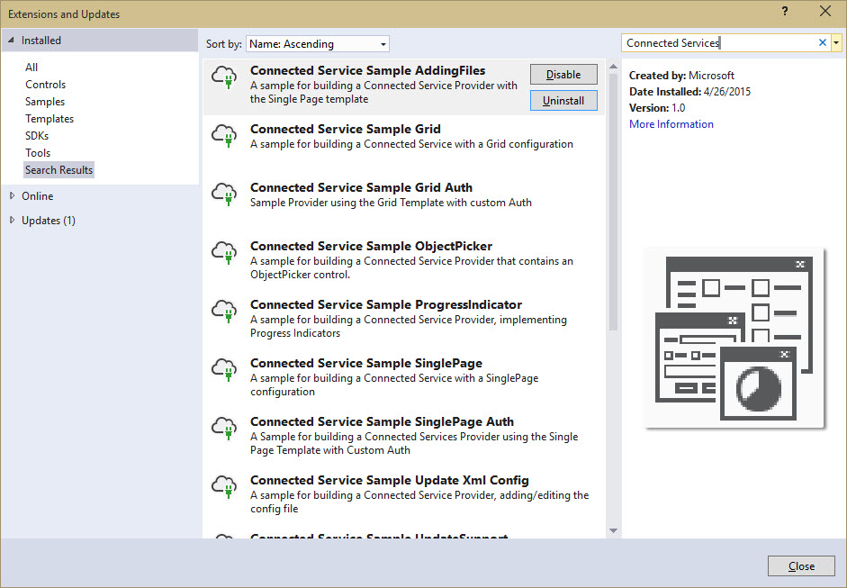

#Setting The Extension Icon#
Creating a nice Icon for your Visual Studio Connected Service extension is a nice touch. But, something you may not have time to mess around with either. Looking at the Visual Studio gallery, you can see that many extensions use the default icon, but it may just be a few elusive settings.

If you're trying to set the icon, but having troubles, here's a quick few tips:

- Set the icon in the `source.extension.vsixmanifest` file

Confirm a few properties are set on the ExtensionIcon file:

- Icon Size = **32x32**, in a **.png** format *(others may work, but I know this does)*
- Build Action = **Content**
- Copy to Output Directory = **Do not copy**
- Include in VSIX = **True**

With these few properties, you can have a full set of connected clouds:

